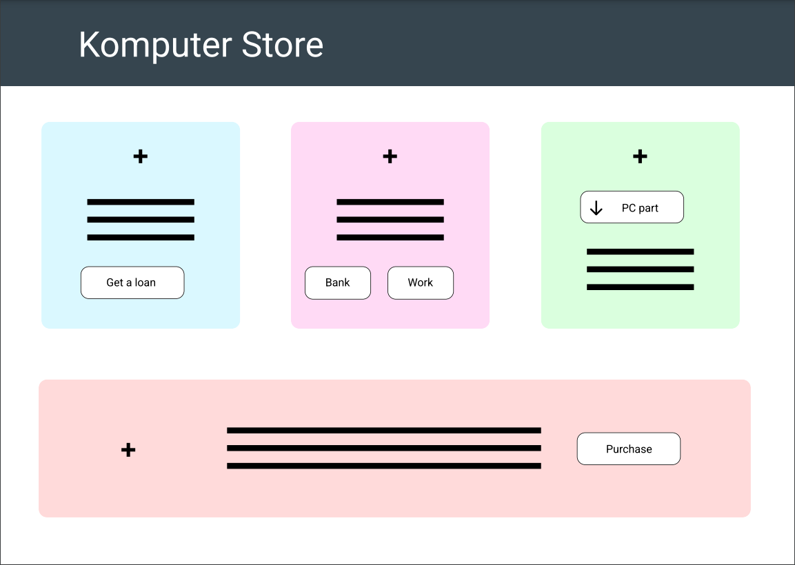

# Front-end assignment 1: Komputer store
​
### Table of contents
* [Introduction](#introduction)
* [Bank tab](#banktab)
* [Deployment](#deployment)
* [Where to access/installations](#where-to-acces/installation)
* [Authors](#authors)
​
​
## Introduction
​

This project is our submission to assignment 1, part of the front-end section of the Noroff Accelerate Fullstack program. The task was given to us by Piotr Dziubinski, lecturer at Noroff University College, Full-Stack Java Development course.The goal of this project is to create a computer store web app using HTML, CSS and JavaScript.

The web app is split into four "tabs". Each tab represtent a uniqe part of the web app, and supplies it own functionality

## Bank tab
The bank shows a “Bank” balance in norwegian currency. This is the amount available for you to buy a laptop.

**Outstanding Loan (Only visible after taking a loan)**

Shows the outstanding Loan value. This is reduced as loan is paid back, or by doing downpayments on the loan.

**Get a loan**

The Get a loan button is used to attempt to get a loan from the bank. When the Get a loan button is clicked, the used is shown a popup box that allows the used to enter the amount of money thay want to borrow. The Get a loan button has a few restrictions to avoid infaltion:

1. You cannot get a loan more than double of your bank balance (i.e., If you have 500 you cannot get a
loan greater than 1000.)
2. You cannot get more than one bank loan before repaying the last loan
3. You may not have two loans at once. The initial loan should be paid back in full. 

## Work tab

The work tab allows the user to work and earn money, which in turn can be used to downpay your loan, or completely pay it of. The Work button allows the used to earn money (100 kr) per click. Note that this money is NOT part of the users bank balance. When the user presses the bank button the following criterias are checked: 
1. If you have an outstanding loan, 10% of your salary MUST first be deducted and transferred to the
outstanding Loan amount
2. The balance after the 10% deduction may be transferred to your bank account

Once the user has a loan, a new button labeled “Repay Loan” appears. Upon clicking this button, the full value of the users current Pay amount goes towards the outstanding loan and NOT their bank account. Any remaining funds after paying the loan is transferred to their bank account

## Laptop- and Store tab

The laptops tab consits of 2 parts: laptop selection area and a info section.

The user is able to a select different laptops from a dropdown menu, that shows the available computers. The feature list of the selected laptop is shown in a ferature section below the dropdown menu. Changing a laptop also updates the user interface with the information for the selected laptop.

The data for the laptops is provided via a RESTful API that returns [JSON data](https://noroff-komputer-store-api.herokuapp.com/computers).

The Store tab shows a image of the selected laptop, its name and description as well as the price to buy it.

The buy now button will attempt to “Buy” a laptop and validate whether the users bank balance is sufficient to purchase the selected laptop. If the bank contains insufficent funds to buy the laptop, a message is shown telling the user that thier balance is too low to buy the laptop.
If the user has a sufficient balance in their Bank account, the amount is deducted from the account and they receive a message that they now are the owner of the laptop!
​
## Wireframe
​

​

## Deployment

The web app has been deployed on Heroku. This was done using a private GitHub repository, containing the code, connected to Heroku for easy of deployment.

[GitHub Repo](https://github.com/SondreEMelhus/front-end-assignment-1)
​
​
## Where to access/installations

1. Create an SSH key and pull the project from the git repository.
2. Open the index.html in your browser

You can also access the web app [here](https://fathomless-shelf-48405.herokuapp.com/)
​

## Project status
Finished.
​

## License
This project is open-source. You are free to use any of the code in your own projects, as long as the work is credited.
​

​
## Authors and acknowledgment
**Code author:**

- [Sondre Melhus](https://gitlab.com/SondreMelhus)
​

**Assignment given by:** 

Piotr Dziubinski, Lecturer at Noroff University College
